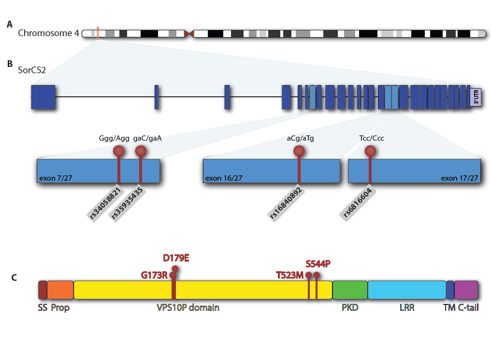
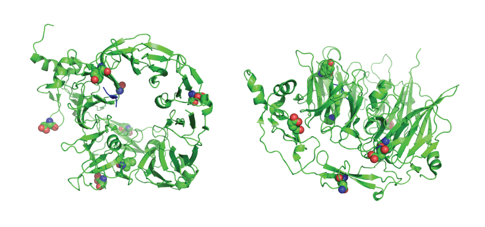

##Analysis Plan

We will pursue a simple, straightforward analysis of our SORCS2 genotypes using a robust, R-based reproducible research approach. This will (i) provide a single document that gives us a complete account of our genetic analysis of SORCS2 and (ii) familiarize us with a scalable, cutting-edge  approach that is capable of handling far more complicated analyses on large datasets.

We will keep all of our work in one R Markdown document: SOCS2_Genetics.Rmd.  

To communicate with one another as we build this document, we will use the SORCS2 repository in my github account (https://github.com/StevenGYounkin/SORCS2), and we will all use git (GitHub gui) for version control. 

All files used or generated by SORCS2_Genetics.Rmd will be in this SORCS2 repo. 

Joseph will take responsiblity for providing whatever help may be needed for each of us to interact effectively with one another on GitHub to produce a final document.

Our goal, which we may or may not achieve, will be to complete a "publication ready"" PLoS ONE manuscript by Monday, November 16.

###What each participant needs:
1. RStudio installed 
2. GitHub installed
3. Local clone of the repo at https://github.com/StevenGYounkin/SORCS2
    + SORCS2_Genetics.Rmd, the file we are generating together, is in this repo
        + All files used or generated by SORCS2_Genetics.Rmd are in this repo
4. R packages installed
    + dplyr
    + data.table
5. PLINK installed and set up so it can be called by R with system("plink......")
6. Perl installed and set up so it can be called by R with system("   ")

###Useful documentation:
1. GitHub
    + https://training.github.com/kit/downloads/github-git-cheat-sheet
2. R Markdown
    + https://www.rstudio.com/wp-content/uploads/2015/02/rmarkdown-cheatsheet.pdf
3. dplyr and tidyr
    + https://www.rstudio.com/wp-content/uploads/2015/02/data-wrangling-cheatsheet.pdf
4. PLINK
    + http://pngu.mgh.harvard.edu/~purcell/plink/
    
###Responsibility for Specific Analysis Steps:
1. Read in existing SORCS2 dataset(s) and initate analysis
    + Steve made the Younkin db (Ydb) dataset available, Joseph made the ADSP dataset available
    + Steve developed functions to read in and analyze the SORCS2 datasets from Ydb (ydb2plink) and adsp2plink. 
    + Steve will complete this analysis, determine how best to display manuscript text, write the introduction.
3. Download ADSP SORCS2 dataset
    + Joseph has downloaded dataset for 1000 samples and will do the rest as the data become available (3000 samples may soon be ready)
4. Create Figure 1 showing a SORCS2 gene diagram with information on SNP location etc.
    + Ben and Leonie are working on this with Maarten's help. 
       
###Steve's Content

####Introduction

This is just some text to read in.This is just some text to read in.This is just some text to read in.This is just some text to read in.This is just some text to read in.This is just some text to read in.This is just some text to read in.This is just some text to read in.
        
This is just some text to read in.This is just some text to read in.This is just some text to read in.This is just some text to read in.This is just some text to read in.This is just some text to read in.This is just some text to read in.This is just some text to read in.This is just some text to read in.This is just some text to read in.This is just some text to read in.This is just some text to read in.This is just some text to read in.This is just some text to read in.This is just some text to read in.This is just some text to read in.This is just some text to read in.This is just some text to read in.
      
####Function (cm2plink) to read in and analyze initial Ydb SORCS2 dataset analyzed 10/2014 by Chris Medway.

On 10/27/14, I sent an email to Anders to which was attached a flat file with our initial Ydb SORCS2 data and some analyses performed by Chris Medway. This flat file, now named SORCS2_CM.csv, was copied into our SORSC2 repo. To improve readability of the html file, the r code which follows in the .Rmd file is not echoed in the html file

```{r, echo=F, eval=T}

        #Create function to read in dataset from Chris Medway (10/27/14)
        #make PLINK files (map, fam, cov.txt, and lgen) and analyze them.

cm2plink <- function(input="SORCS2_CM.csv", output="SORCS2_CM") {

        #load requisite packages       
        library(data.table)
        suppressWarnings(suppressMessages(library(dplyr)))
        
        #To debug, it was convenient to provide the input called by the function here
        #input <- "SORCS2_CM.csv"
        
        #Read in dataset generated from the Younkin database, commands commented out were usefu for debugging
        data <- read.table(input, sep=',', stringsAsFactors = FALSE, header=T)
        #str(data);head(data); tail(data)

        #To debug, it was convenient to provide the output called by the function here
        #output <- "SORCS2.CM"
        
        #Create output files
        out1 <- paste(output,sep="",".map")
        out2 <- paste(output,sep="",".fam")
        out3 <- paste(output,sep="","_cov.txt")
        out4 <- paste(output,sep="",".lgen")
        out5 <- paste(output,sep="",".plink.csv")
        #print(out1);print(out2);print(out3);print(out4);print(out5)

        #Generate PLINK map file by copying and renaming "SORCS2_YdB.map"
        map <- read.table("SORCS2_YdB.map", stringsAsFactors = FALSE, header=F)
        #print(map,row.names=F, col.names=F)
        write.table(map,out1,sep='\t',quote=FALSE,row.names=F,col.names=F)

        #In his flat file, Chris encoded each SNP as a separate column with 0,1,2 coding
        #There'is additional wrangling to do to produce map, fam, cov, and lgen files

        #Add columns that are not in Chris file and rename as needed
        data <- mutate(data, PID=0, MID=0, rs="rs", A1=0, A2=0)
        data <- rename (data,IID=SubKey, AFF=Dx2, JS=JS_SIB, NCRAD=INDIANA, Age=DxAge, APOE4dose=APOE4, APOE2dose=APOE2)
        #str(data)

        #Recode as needed to conform to PLINK cov and fam conventions
        data[data$AFF == 1,][, "AFF"] <- 2
        data[data$AFF == 0,][, "AFF"] <- 1

        data[data$SEX == 1,][, "SEX"] <- 2
        data[data$SEX == 0,][, "SEX"] <- 1

        #Check coding for PLINK
        #print(data %>% group_by(AFF,SEX,APOE4dose, APOE2dose,A1,A2) %>% summarize(n=n()))
        #print.data.frame(data %>% group_by(A1,A2) %>% summarize(n=n()))
        #print.data.frame(data %>% group_by(rs,AFF) %>% summarize(n=n()))
        #print.data.frame(data %>% group_by(SEX) %>% summarize(n=n()))
        #print.data.frame(data %>% group_by(APOE4dose,APOE2dose) %>% summarize(n=n()))      
        #print.data.frame(y)

        #Create PLINK fam file
        fam <- select(data,FID,IID,PID,MID,SEX,AFF)
        fam <- distinct(fam)
        #str(fam); head(fam); tail(fam)
        write.table(fam,out2,sep='\t',quote=FALSE,row.names=F,col.names=F)
        #SORCS2fam=read.table("SORCS2.fam", header = F)
        #str(SORCS2fam);head(SORCS2fam);tail(SORCS2fam)

        #Create PLINK cov file; 
        #Not sure why, but errors sometimes occurred in r when using out3.cov" as output using write.table
        #So I used "out3_cov.txt" thereby avoiding this problem
        cov <- select(data,FID,IID,JS,RS,AUT,NCRAD,NW,SEX,Age,APOE4dose,APOE2dose)
        cov <- distinct(cov)
        #str(cov)
        write.table(cov,out3,sep='\t',quote=FALSE,row.names=F,col.names=T)
        #SORCS2cov=read.table, out3, header = T)
        #str(SORCS2cov);head(SORCS2cov); tail(SORCS2cov)

        #Create PLINK lgen file, this could have been done better by creating a function to add each
        # to the bottom of an lgen file, and calling the function successively. I copied and revised the code.
        
        #Create lgen file with rs34058821 genotypes
        lgen <- select(data,FID,IID,SORCS2_rs34058821_GA,rs,A1,A2)
        #str(lgen)
        lgen <- rename(lgen, Call=SORCS2_rs34058821_GA)
        #str(lgen)
        lgen <- mutate(lgen, rs="rs34058821")
        #str(lgen)
        # Keep only calls of 0,1,or 2 so there is no missing data
        call <- c(0,1,2)
        lgen <- filter(lgen, Call %in% call)
        #print.data.frame(lgen %>% group_by(rs,Call) %>% summarize(n()))

        #Create lgen file with rs35935435 genotypes
        x <- select(data,FID,IID,SORCS2_rs35935435_CA,rs,A1,A2)
        #str(x)
        x <- rename(x, Call=SORCS2_rs35935435_CA)
        #str(x)
        x <- mutate(x, rs="rs35935435")
        #str(x)
        # Keep only calls of 0,1,or 2 so there is no missing data
        call <- c(0,1,2)
        x <- filter(x, Call %in% call) 
        #print.data.frame(x %>% group_by(rs,Call) %>% summarize(n()))

        #Add rs35935435 genotypes in lgen format to the bottom of lgen 
        lgen <- bind_rows(lgen,x)
        #print.data.frame(lgen %>% group_by(rs,Call) %>% summarize(n()))

        #Create lgen file with rs16840892 genotypes
        x <- select(data,FID,IID,SORCS2_rs16840892_CT,rs,A1,A2)
        #str(x)
        x <- rename(x, Call=SORCS2_rs16840892_CT)
        #str(x)
        x <- mutate(x, rs="rs16840892")
        #str(x)
        # Keep only calls of 0,1,or 2 so there is no missing data
        call <- c(0,1,2)
        x <- filter(x, Call %in% call)
        #print.data.frame(x %>% group_by(rs,Call) %>% summarize(n()))

        #Add rs16840892 genotypes in lgen format to the bottom of lgen
        lgen <- bind_rows(lgen,x)
        #print.data.frame(lgen %>% group_by(rs,Call) %>% summarize(n()))

        #Create lgen file with rs6816604 genotypes
        x <- select(data,FID,IID,SORCS2_rs6816604_CT,rs,A1,A2)
        #str(x)
        x <- rename(x, Call=SORCS2_rs6816604_CT)
        #str(x)
        x <- mutate(x, rs="rs6816604")
        #str(x)
        call <- c(0,1,2)
        x <- filter(x, Call %in% call)
        #print.data.frame(x %>% group_by(rs,Call) %>% summarize(n()))

        #Add rs6816604 genotypes in lgen format to the bottom of lgen
        lgen <- bind_rows(lgen,x)
        #print.data.frame(lgen %>% group_by(rs,Call) %>% summarize(n()))

        #Separate the alleles as required by PLINK
        lgen[lgen$Call == 0,][, "A1"] <- 1
        lgen[lgen$Call == 1,][, "A1"] <- 1
        lgen[lgen$Call == 2,][, "A1"] <- 2

        lgen[lgen$Call == 0,][, "A2"] <- 1
        lgen[lgen$Call == 1,][, "A2"] <- 2
        lgen[lgen$Call == 2,][, "A2"] <- 2
        #For debugging use commands like the one below to check format
        #print.data.frame(lgen %>% group_by(rs,Call,A1,A2) %>% summarize(n()))

        #Select columns for lgen file and write it out
        lgen <- select(lgen,FID,IID,rs,A1,A2)
        #str(lgen)
        write.table(lgen,out4,sep='\t',quote=FALSE,row.names=F,col.names=F)
        #SORCS2lgen=read.table("SORCS2.lgen", header = F)
        #str(SORCS2lgen)

        #Analyse the files in PLINK, format, and print the output. The analysis here is the same as that 
        #in the script for the adsp2plink function below, where it is better annotated.
        
        assoc <- paste("plink",sep=" ","--lfile", output, "--assoc", "--ci 0.95", "--out", output)
        logistic <- paste("plink",sep=" ","--lfile", output, "--logistic", "--covar", out3, "--covar-name RS,AUT,NCRAD,NW,SEX,Age,APOE4dose,APOE2dose", "--ci 0.95", "--mhf 0.005 --out", output)
        haplog <- paste("plink",sep=" ","--lfile", output, "--hap-window 4 --hap-logistic", "--covar", out3, "--covar-name RS,AUT,NCRAD,NW,SEX,Age,APOE4dose,APOE2dose", "--ci 0.95", "--mhf 0.005 --out", output)

        assocfile <- paste(output,sep="",".assoc")
        logisfile <- paste(output,sep="",".assoc.logistic")
        haplogfile <- paste(output,sep="",".assoc.hap.logistic")

        system(assoc)
        system(logistic)
        system(haplog)

        f1 <- read.table(assocfile, header=T)
        #print(f1)
        f1 <- f1 %>% select(CHR,SNP,BP,F_A, F_U, OR, P) %>% rename(FREQ_AD=F_A, FREQ_CON=F_U, OR_assoc=OR, P_assoc=P)
        print(f1,digits=2,row.names=F)
        print("", quote=F)
        #head(f1)

        f1 <- f1 %>% select(CHR,SNP,BP,FREQ_AD,FREQ_CON)
        f2 <- read.table(logisfile, header=T)
        #print(f2)
        f2 <- f2 %>% filter (TEST=="ADD") %>% select (SNP,NMISS,OR,L95,U95,P) %>% rename(OR_logis=OR, P_logis=P)
        #head(f2)
        f3<- left_join(f1,f2,by="SNP")
        print(f3,digits=2,row.names=F)
        print("", quote=F)
        write.table(f3,out5,sep=",", quote=FALSE,row.names=F,col.names=T)

        f4 <- read.table(haplogfile, header=T)
        f4 <- f4 %>% select(-NSNP,-NHAP,-STAT) %>% arrange(desc(HAPLOTYPE))
        print(f4,digits=2, row.names=F)
        print("", quote=F)

        hapomni <- paste("plink",sep=" ","--lfile", output, "--hap-window 4 --hap-logistic", "--covar", out3, "--covar-name RS,AUT,NCRAD,NW,SEX,Age,APOE4dose,APOE2dose", "--ci 0.95", "--mhf 0.005 --hap-omnibus --out", output)
        system(hapomni)
        f4 <- read.table(haplogfile, header=T)
        f4 <- f4 %>% rename(Pomni=P)
        print(f4,digits=2, row.names=F)
        print("", quote=F)
}

```


####Function (ydb2plink) to read in and analyze Ydb SORCS2 dataset
The data we have on the 4 common SORCS2 missense variants in the Younkin database (YdB) were captured using the following query:

SELECT        TOP (100) PERCENT Younkin.dbo.Subject.SubKey, Younkin.dbo.Subject.SubjectIDType, Younkin.dbo.Subject.SubjectIDValue, Younkin.dbo.Subject.Series, 
                         Younkin.dbo.Subject.Dx, Younkin.dbo.Subject.ApoE, Younkin.dbo.Subject.DxAge, Younkin.dbo.Subject.Gend, Younkin.dbo.Variant.VariantID, 
                         Younkin.dbo.Variant.VariantName, Younkin.dbo.VariantDataAll.Call, Younkin.dbo.VariantDataAll.BestCall, Younkin.dbo.Variant_New.chr, 
                         Younkin.dbo.Variant_New.position, Younkin.dbo.Variant_New.rs
FROM            Younkin.dbo.VariantDataAll INNER JOIN
                         Younkin.dbo.Variant ON Younkin.dbo.VariantDataAll.VariantID = Younkin.dbo.Variant.VariantID INNER JOIN
                         Younkin.dbo.Subject ON Younkin.dbo.VariantDataAll.SKey = Younkin.dbo.Subject.SubKey INNER JOIN
                         Younkin.dbo.Variant_New ON Younkin.dbo.VariantDataAll.VariantID = Younkin.dbo.Variant_New.VariantID
WHERE        (Younkin.dbo.Variant.VariantID = 2069 OR
                         Younkin.dbo.Variant.VariantID = 2070 OR
                         Younkin.dbo.Variant.VariantID = 2072 OR
                         Younkin.dbo.Variant.VariantID = 2073)
ORDER BY Younkin.dbo.Variant.VariantID

The results of this query were copied into SORCS2_Ydb.csv To improve readability of the html file, the r code which follows in the .Rmd file is not echoed in the html file

```{r, eval=T, echo=F}

        #Create function to read in SQL-derived dataset from Younkin database, 
        #make PLINK files (map, fam, cov.txt, and lgen) and analyze them.

ydb2plink <- function(input="SORCS2_Ydb.csv", output="SORCS2.Ydb") {

        #load requisite packages       
        library(data.table)
        suppressWarnings(suppressMessages(library(dplyr)))

        #To debug, it was convenient to provide the input called by the function here
        #input="SORCS2_Ydb.csv"   
        
        #Read in dataset generated from the Younkin database
        data <- read.table(input, sep=',', stringsAsFactors = FALSE, header=T)

        #Create output files
        
        #To debug, it was convenient to provide the output called by the function here
        #output <- "SORCS2.Ydb"
        
        #Generate names for the PLINK files and the .csv files that will be generated
        out1 <- paste(output,sep="",".map")
        out2 <- paste(output,sep="",".fam")
        out3 <- paste(output,sep="","_cov.txt")
        out4 <- paste(output,sep="",".lgen")
        out5 <- paste(output,sep="",".plink.csv")
        #print(out1);print(out2);print(out3);print(out4);print(out5)

        #Generate PLINK map file
        map <- select(data,chr, rs, position)
        map <- mutate(map,morgans=0)
        map <- rename(map, bp=position)
        map <- select(map,chr,rs,morgans,bp)
        map <- distinct(map)
        #print(map)
        write.table(map,out1,sep='\t',quote=FALSE,row.names=F,col.names=F)

        #Filter, using dplyr package, to include only subjects with: 
        #Dx = AD or CON, Gend = M or F, ApoE = 22,23,24,33,34,or 44 
        #Series = JS,SibPair_White,RS,AUT,Indiana,NW, DxAge >= 65, BestCall = 1
        #Age (at diagnosis for AD/at entry for CON) of 65 or over
        dx <- c("AD","CON")
        sex <- c("M","F")
        apoe <- c(22,23,24,33,34,44)
        series <- c("JS", "RS", "AUT", "Indiana", "SibPair_White", "NW")
        data <- filter(data, Dx %in% dx, Gend %in% sex, ApoE %in% apoe, Series %in% series, BestCall == 1)
        data <-suppressWarnings(mutate(data,Age=as.numeric(DxAge)))
        data <- filter (data, Age >= 65)

        #Create columns for PLINK fam, cov, and lgen files
        data <- mutate(data, AFF=99, A1=99, A2=99, APOE4dose=99, APOE2dose=99, SEX=99, JS=0, RS=0, AUT=0, NCRAD=0,NW=0, FID=0, IID=SubKey, PID=0, MID=0)
        
        #Populate variables, making sure to hew to PLINK convention

        data[data$Dx == "AD",][, "AFF"] <- 2
        data[data$Dx == "CON",][, "AFF"] <- 1

        data[data$Call == 11,][, "A1"] <- 1
        data[data$Call == 12,][, "A1"] <- 1
        data[data$Call == 22,][, "A1"] <- 2

        data[data$Call == 11,][, "A2"] <- 1
        data[data$Call == 12,][, "A2"] <- 2
        data[data$Call == 22,][, "A2"] <- 2

        data[data$Gend == "M",][, "SEX"] <- 1
        data[data$Gend == "F",][, "SEX"] <- 2

        data[data$ApoE == 22,][, "APOE4dose"] <- 0
        data[data$ApoE == 23,][, "APOE4dose"] <- 0
        data[data$ApoE == 24,][, "APOE4dose"] <- 1
        data[data$ApoE == 33,][, "APOE4dose"] <- 0
        data[data$ApoE == 34,][, "APOE4dose"] <- 1
        data[data$ApoE == 44,][, "APOE4dose"] <- 2

        data[data$ApoE == 22,][, "APOE2dose"] <- 2
        data[data$ApoE == 23,][, "APOE2dose"] <- 1
        data[data$ApoE == 24,][, "APOE2dose"] <- 1
        data[data$ApoE == 33,][, "APOE2dose"] <- 0
        data[data$ApoE == 34,][, "APOE2dose"] <- 0
        data[data$ApoE == 44,][, "APOE2dose"] <- 0

        data[data$Series == "JS",][, "JS"] <- 1
        data[data$Series == "SibPair_White",][, "JS"] <- 1
        data[data$Series == "RS",][, "RS"] <- 1
        data[data$Series == "AUT",][, "AUT"] <- 1
        data[data$Series == "Indiana",][, "NCRAD"] <- 1
        data[data$Series == "NW",][, "NW"] <- 1

        #Check coding for PLINK during debugging, using dplyr as exemplified below
        #print(data %>% group_by(rs,AFF,SEX,APOE4dose, APOE2dose,A1,A2) %>% summarize(n=n()))
        #print.data.frame(data %>% group_by(rs,A1,A2) %>% summarize(n=n()))
        #print.data.frame(data %>% group_by(rs,AFF) %>% summarize(n=n()))
        #print.data.frame(data %>% group_by(rs,SEX) %>% summarize(n=n()))
        #print.data.frame(data %>% group_by(APOE4dose,APOE2dose) %>% summarize(n=n()))      
        #print.data.frame(y)

        #Create PLINK fam file, commands commented out were useful during debugging
        fam <- select(data,FID,IID,PID,MID,SEX,AFF)
        fam <- distinct(fam)
        #str(fam); head(fam); tail(fam)
        write.table(fam,out2,sep='\t',quote=FALSE,row.names=F,col.names=F)
        #SORCS2fam=read.table("SORCS2.fam", header = F)
        #str(SORCS2fam);head(SORCS2fam);tail(SORCS2fam)

        #Create PLINK cov file, commands commented out were useful during debugging
        #Not sure why, but errors sometimes occurred in r when using "SORCS2.cov"" as output using write.table
        #So I used "SORCS2cov.txt" thereby avoiding this problem
        cov <- select(data,FID,IID,JS,RS,AUT,NCRAD,NW,SEX,Age,APOE4dose,APOE2dose)
        cov <- distinct(cov)
        #str(cov)
        write.table(cov,out3,sep='\t',quote=FALSE,row.names=F,col.names=T)
        #SORCS2cov=read.table("SORCS2cov.txt", header = T)
        #str(SORCS2cov);head(SORCS2cov); tail(SORCS2cov)

        #Create PLINK lgen file
        lgen <- select(data,FID,IID,rs,A1,A2)
        #str(lgen)
        write.table(lgen,out4,sep='\t',quote=FALSE,row.names=F,col.names=F)
        #SORCS2lgen=read.table("SORCS2.lgen", header = F)
        #str(SORCS2lgen)

        #Analyse the files in PLINK, format, and print the output. The analysis here is the same as that 
        #in the script for the adsp2plink function below, where it is better annotated.        
        
        assoc <- paste("plink",sep=" ","--lfile", output, "--assoc", "--ci 0.95", "--out", output)
        logistic <- paste("plink",sep=" ","--lfile", output, "--logistic", "--covar", out3, "--covar-name RS,AUT,NCRAD,NW,SEX,Age,APOE4dose,APOE2dose", "--ci 0.95", "--mhf 0.005 --out", output)
        haplog <- paste("plink",sep=" ","--lfile", output, "--hap-window 4 --hap-logistic", "--covar", out3, "--covar-name RS,AUT,NCRAD,NW,SEX,Age,APOE4dose,APOE2dose", "--ci 0.95", "--mhf 0.005 --out", output)

        assocfile <- paste(output,sep="",".assoc")
        logisfile <- paste(output,sep="",".assoc.logistic")
        haplogfile <- paste(output,sep="",".assoc.hap.logistic")

        system(assoc)
        system(logistic)
        system(haplog)

        f1 <- read.table(assocfile, header=T)
        #print(f1)
        f1 <- f1 %>% select(CHR,SNP,BP,F_A, F_U, OR, P) %>% rename(FREQ_AD=F_A, FREQ_CON=F_U, OR_assoc=OR, P_assoc=P)
        print(f1,digits=2,row.names=F)
        print("", quote=F)
        #head(f1)

        f1 <- f1 %>% select(CHR,SNP,BP,FREQ_AD,FREQ_CON)
        f2 <- read.table(logisfile, header=T)
        #print(f2)
        f2 <- f2 %>% filter (TEST=="ADD") %>% select (SNP,NMISS,OR,L95,U95,P) %>% rename(OR_logis=OR, P_logis=P)
        #head(f2)
        f3<- left_join(f1,f2,by="SNP")
        print(f3,digits=2,row.names=F)
        print("", quote=F)
        write.table(f3,out5,sep=",", quote=FALSE,row.names=F,col.names=T)
        #print("PLINK commands:");print(assoc);print(logistic)

        f4 <- read.table(haplogfile, header=T)
        f4 <- f4 %>% select(-NSNP,-NHAP,-STAT) %>% arrange(desc(HAPLOTYPE))
        print(f4,digits=2, row.names=F)
        print("", quote=F)

        hapomni <- paste("plink",sep=" ","--lfile", output, "--hap-window 4 --hap-logistic", "--covar", out3, "--covar-name RS,AUT,NCRAD,NW,SEX,Age,APOE4dose,APOE2dose", "--ci 0.95", "--mhf 0.005 --hap-omnibus --out", output)
        system(hapomni)
        f4 <- read.table(haplogfile, header=T)
        f4 <- f4 %>% rename(Pomni=P)
        print(f4,digits=2, row.names=F)
        print("", quote=F)
}

```

####Function (adsp2plink) to read in and analyze ADSP SORCS2 dataset

The data we have on the 4 common SORCS2 missense variants in our ADSP dataset was captured by Joseph Reddy in a flatfile (SORCS2_ff.txt) as described in his section below. I read in the dataset (SORCS2_ff.txt) from the SORSC2 repo.The following function reads the data in, creates PLINK, files and then analyzes them in PLINK as for the SORCS2 dataset from the Younkin database.

```{r, eval=T, echo=F}
        #Create function that (i) reads in the ADSP dataset generated by Joseph Reddy, (ii) outputs PLINK map, fam, cov.txt, and lgen files,
        #(iii) analyzes in PLINK using --assoc, as well as --logistic, and --hap-logistic with appropriate covariates, 
        #(iv) prints out well organized results
        
adsp2plink <- function(input="SORCS2_ff.txt", output="SORCS2.adsp") {

        #load requisite packages       
        library(data.table)
        suppressWarnings(suppressMessages(library(dplyr)))  
        
        #While debugging it is helpful to set input and output values that will be called by the function
        #It is also useful to employ the various str and print commands that are commented out below
        #input <- "SORCS2_ff.txt"
        #output <- "SORCS2.adsp"        
        #Read in data on 4 common SORCS2 missense variants in the ADSP database        
        
        data <- read.table(input, stringsAsFactors = FALSE, header=T)
        #str(data); head(data); tail(data)

        #Create output files
        out1 <- paste(output,sep="",".map")
        out2 <- paste(output,sep="",".fam")
        out3 <- paste(output,sep="","_cov.txt")
        out4 <- paste(output,sep="",".lgen")
        out5 <- paste(output,sep="",".plink.csv")
        #print(out1);print(out2);print(out3);print(out4);print(out5)

        #Filter, using dplyr, to include only subjects with: 
        #Case.control = 2 or 1 corresponding to AD or CON, Sex = 0 or 1 (M or F), APOE = 22,23,24,33,34,or 44 
        #Series = ADSP, Age >= 65, Call = 11,12, or 22
        library(dplyr)
        dx_1 <- c(2,1,0)
        sex_1 <- c(0,1)
        apoe_1 <- c(22,23,24,33,34,44)
        series_1 <- c("ADSP")
        call_1 <- c(11,12,22)
        data <- filter(data, Case.control %in% dx_1, Sex %in% sex_1, APOE %in% apoe_1, Series %in% series_1, Call %in% call_1)
        data <- filter (data, Age >= 65)
        #str(data);head(data);tail(data)

        #Create PLINK map file
        map <- select(data, SNP_ID, Position)
        map <- mutate(map,morgans=0, chr=4)
        map <- rename(map, bp=Position, rs=SNP_ID)
        map <- select(map,chr,rs,morgans,bp)
        map <- distinct(map)
        snps <- c("rs6816604","rs35935435","rs16840892","rs34058821")
        map <- filter(map,rs %in% snps )
        print(map)
        write.table(map,out1,sep='\t',quote=FALSE,row.names=F,col.names=F)

        #Create variables for PLINK fam, cov, and lgen files
        data <- mutate(data, AFF=99, A1=99, A2=99, APOE4dose=99, APOE2dose=99, SEX=99, ADSP=0, FID=0, IID=as.character(Subject_ID), PID=0, MID=0)

        data[data$Case.control == 0,][, "AFF"] <- 1  #CON=0
        data[data$Case.control == 1,][, "AFF"] <- 2  #AD=1
        data[data$Case.control == 2,][, "AFF"] <- 2  #probable AD=2 are included as AD for PLINK analysis

        data[data$Call == 11,][, "A1"] <- 1  #1 = major allele, 2 = minor allele
        data[data$Call == 12,][, "A1"] <- 1  #split the allele calls as required by PLINK
        data[data$Call == 22,][, "A1"] <- 2  

        data[data$Call == 11,][, "A2"] <- 1
        data[data$Call == 12,][, "A2"] <- 2
        data[data$Call == 22,][, "A2"] <- 2

        data[data$Sex == 0,][, "SEX"] <- 1   #M=0
        data[data$Sex == 1,][, "SEX"] <- 2   #F=1

        data[data$APOE == 22,][, "APOE4dose"] <- 0 #code dose of A4 allele, 0,1,or2
        data[data$APOE == 23,][, "APOE4dose"] <- 0
        data[data$APOE == 24,][, "APOE4dose"] <- 1
        data[data$APOE == 33,][, "APOE4dose"] <- 0
        data[data$APOE == 34,][, "APOE4dose"] <- 1
        data[data$APOE == 44,][, "APOE4dose"] <- 2

        data[data$APOE == 22,][, "APOE2dose"] <- 2 #code dose of A4 allele, 0,1,or2
        data[data$APOE == 23,][, "APOE2dose"] <- 1
        data[data$APOE == 24,][, "APOE2dose"] <- 1
        data[data$APOE == 33,][, "APOE2dose"] <- 0
        data[data$APOE == 34,][, "APOE2dose"] <- 0
        data[data$APOE == 44,][, "APOE2dose"] <- 0

        data[data$Series == "ADSP",][, "ADSP"] <- 1 #1 indicates subject is ADSP, otherwise would be 0
        #For debugging, evaluate whether data has been formatted correctly by filtering and grouping appropriately
        #y <- data %>% filter(rs=="rs6816604",JS==1) %>% group_by(rs,Dx,A1,A2) %>% summarize(n=n())
        #print(y)

        #Create PLINK fam file
        fam <- select(data,FID,IID,PID,MID,SEX,AFF)
        fam <- distinct(fam)
        #str(fam); head(fam); tail(fam)
        write.table(fam,out2,sep='\t',quote=FALSE,row.names=F,col.names=F)
        #SORCS2fam_1=read.table("SORCS2_1.fam", header = F)
        #str(SORCS2fam_1);head(SORCS2fam_1);tail(SORCS2fam_1)

        #Create PLINK cov file; 
        #Not sure why, but errors sometimes occurred in r when using "SORCS2.cov"" as output using write.table
        #So I used "SORCS2cov.txt" thereby avoiding this problem
        cov <- select(data,FID,IID,ADSP,SEX,Age,APOE4dose,APOE2dose)
        cov <- distinct(cov)
        #For debugging make sure structure looks good
        #str(cov)
        write.table(cov,out3,sep='\t',quote=FALSE,row.names=F,col.names=T)
        #For debugging read table back in and make sure it looks right
        #SORCS2cov_1=read.table("SORCS2_1cov.txt", header = T)
        #str(SORCS2cov_1);head(SORCS2cov_1); tail(SORCS2cov_1)

        #Create PLINK lgen file
        lgen <- select(data,FID,IID,SNP_ID,A1,A2)
        #str(lgen)
        write.table(lgen,out4,sep='\t',quote=FALSE,row.names=F,col.names=F)

        #Create command strings for --assoc, --logistic, and --haplogistic
        assoc <- paste("plink",sep=" ","--lfile", output, "--assoc", "--ci 0.95", "--out", output)
        logistic <- paste("plink",sep=" ","--lfile", output, "--logistic", "--covar", out3, "--covar-name SEX,Age,APOE4dose,APOE2dose", "--ci 0.95", "--out", output)
        haplog <- paste("plink",sep=" ","--lfile", output, "--hap-window 4 --hap-logistic", "--covar", out3, "--covar-name SEX,Age,APOE4dose,APOE2dose", "--ci 0.95", "--mhf 0.005 --out", output)

        #Create names for the files that PLINK generates
        assocfile <- paste(output,sep="",".assoc")
        logisfile <- paste(output,sep="",".assoc.logistic")
        haplogfile <- paste(output,sep="",".assoc.hap.logistic")

        #Run the PLINK analyses
        system(assoc)
        system(logistic)
        system(haplog)

        #Read in, format, and print the results from --assoc
        f1 <- read.table(assocfile, header=T)
        #print(f1)
        f1 <- f1 %>% select(CHR,SNP,BP,F_A, F_U, OR, P) %>% rename(FREQ_AD=F_A, FREQ_CON=F_U, OR_assoc=OR, P_assoc=P)
        print(f1,digits=2,row.names=F)
        print("", quote=F)
        #head(f1)

        #Read in results for --logistic, combine with results from --logistic, format, print
        f1 <- f1 %>% select(CHR,SNP,BP,FREQ_AD,FREQ_CON)
        f2 <- read.table(logisfile, header=T)
        #print(f2)
        f2 <- f2 %>% filter (TEST=="ADD") %>% select (SNP,NMISS,OR,L95,U95,P) %>% rename(OR_logis=OR, P_logis=P)
        #head(f2)
        f3<- left_join(f1,f2,by="SNP")
        print(f3,digits=2,row.names=F)
        print("", quote=F)
        write.table(f3,out5,sep=",", quote=FALSE,row.names=F,col.names=T)

        #Read in results for --hap-logistic, format, print
        f4 <- read.table(haplogfile, header=T)
        f4 <- f4 %>% select(-NSNP,-NHAP,-STAT) %>% arrange(desc(HAPLOTYPE))
        print(f4,digits=2, row.names=F)
        print("", quote=F)

        #Run and read in results for "--hap-logistic --hap-omnibus"", format, print
        hapomni <- paste("plink",sep=" ","--lfile", output, "--hap-window 4 --hap-logistic", "--covar", out3, "--covar-name SEX,Age,APOE4dose,APOE2dose", "--ci 0.95", "--mhf 0.005 --hap-omnibus --out", output)
        system(hapomni)
        f4 <- read.table(haplogfile, header=T)
        f4 <- f4 %>% rename(Pomni=P)
        print(f4,digits=2, row.names=F)
        print("", quote=F)
}
```

####Function (comb2plink) to create combined ydb-adsp dataset and analyse it
```{r, echo=F, eval=T}
comb2plink <- function(output="SORCS2.comb") {

                #load requisite packages       
library(data.table)
suppressWarnings(suppressMessages(library(dplyr)))

        #Create output files
output <- "SORCS2.comb"
out1 <- paste(output,sep="",".map")
out2 <- paste(output,sep="",".fam")
out3 <- paste(output,sep="","_cov.txt")
out4 <- paste(output,sep="",".lgen")
out5 <- paste(output,sep="",".plink.csv") 

        #Generate PLINK map file by copying and renaming "SORCS2.adsp.map"
map <- read.table("SORCS2.adsp.map", header = F)
write.table(map, out1, sep='\t',quote=FALSE,row.names=F,col.names=F)

        #Use dplyr bind_rows to generate combined fam, cov, and lgen files

fam.ydb <- read.table("SORCS2.Ydb.fam", header=F, stringsAsFactors = FALSE)
colnames(fam.ydb) <- c("FID","IID","PID","MID","SEX","AFF")
  #Change IID from number to character for compatiblity with fam.adsp
fam.ydb <- fam.ydb %>% mutate(IID=as.character(IID)) 
#str(fam.ydb)
fam.adsp <- read.table("SORCS2.adsp.fam", header=F, stringsAsFactors = FALSE)
colnames(fam.adsp) <- c("FID","IID","PID","MID","SEX","AFF")
#str(fam.adsp)
fam.comb <- bind_rows(fam.ydb,fam.adsp)
#str(fam.comb)
write.table(fam.comb, out2, sep='\t',quote=FALSE,row.names=F,col.names=F)

cov.ydb <- read.table("SORCS2.Ydb_cov.txt", header=T, stringsAsFactors = FALSE)
cov.ydb <- cov.ydb %>% mutate(IID=as.character(IID))
#str(cov.ydb)
cov.adsp <- read.table("SORCS2.adsp_cov.txt", header=T, stringsAsFactors = FALSE)
#str(cov.adsp)
cov.comb <- bind_rows(cov.ydb,cov.adsp)
#str(cov.comb)
x <- cov.comb %>% group_by(JS,RS,AUT,NCRAD,NW,ADSP) %>% summarise(n())
#print(x)
                #Combined series covariates had NAs that should be 0                
cov.comb[is.na(cov.comb)]<-0
x <- cov.comb %>% group_by(JS,RS,AUT,NCRAD,NW,ADSP) %>% summarise(n())
#print(x)
                # NA replaced by 0 in all series covariates
write.table(cov.comb, out3, sep='\t',quote=FALSE,row.names=F,col.names=T)

lgen.ydb <- read.table("SORCS2.Ydb.lgen", header=F, stringsAsFactors = FALSE)
colnames(lgen.ydb) <- c("FID","IID","rs","A1","A2")
lgen.ydb <- lgen.ydb %>% mutate(IID=as.character(IID))
#str(lgen.ydb)
lgen.adsp <- read.table("SORCS2.adsp.lgen", header=F, stringsAsFactors = FALSE)
colnames(lgen.adsp) <- c("FID","IID","rs","A1","A2")
#str(lgen.adsp)
lgen.comb <- bind_rows(lgen.ydb,lgen.adsp)
#str(lgen.comb)
write.table(lgen.comb, out4, sep='\t',quote=FALSE,row.names=F,col.names=F)

assoc <- paste("plink",sep=" ","--lfile", output, "--assoc", "--ci 0.95", "--out", output)
logistic <- paste("plink",sep=" ","--lfile", output, "--logistic", "--covar", out3, "--covar-name RS,AUT,NCRAD,NW,SEX,Age,APOE4dose,APOE2dose", "--ci 0.95", "--out", output)
haplog <- paste("plink",sep=" ","--lfile", output, "--hap-window 4 --hap-logistic", "--covar", out3, "--covar-name RS,AUT,NCRAD,NW,ADSP,SEX,Age,APOE4dose,APOE2dose", "--ci 0.95", "--mhf 0.005 --out", output)


assocfile <- paste(output,sep="",".assoc")
logisfile <- paste(output,sep="",".assoc.logistic")
haplogfile <- paste(output,sep="",".assoc.hap.logistic")

system(assoc)
system(logistic)
system(haplog)

f1 <- read.table(assocfile, header=T)
#print(f1)
f1 <- f1 %>% select(CHR,SNP,BP,F_A, F_U, OR, P) %>% rename(FREQ_AD=F_A, FREQ_CON=F_U, OR_assoc=OR, P_assoc=P)
print(f1,digits=2,row.names=F)
print("", quote=F)
#head(f1)

f1 <- f1 %>% select(CHR,SNP,BP,FREQ_AD,FREQ_CON)
f2 <- read.table(logisfile, header=T)
#print(f2)
f2 <- f2 %>% filter (TEST=="ADD") %>% select (SNP,NMISS,OR,L95,U95,P) %>% rename(OR_logis=OR, P_logis=P)
#head(f2)
f3<- left_join(f1,f2,by="SNP")
print(f3,digits=2,row.names=F)
print("", quote=F)
write.table(f3,out5,sep=",", quote=FALSE,row.names=F,col.names=T)

f4 <- read.table(haplogfile, header=T)
f4 <- f4 %>% select(-NSNP,-NHAP,-STAT) %>% arrange(desc(HAPLOTYPE))
print(f4,digits=2, row.names=F)
print("", quote=F)

hapomni <- paste("plink",sep=" ","--lfile", output, "--hap-window 4 --hap-logistic", "--covar", out3, "--covar-name RS,AUT,NCRAD,NW,ADSP,SEX,Age,APOE4dose,APOE2dose", "--ci 0.95", "--mhf 0.005 --hap-omnibus --out", output)
system(hapomni)
f4 <- read.table(haplogfile, header=T)
f4 <- f4 %>% rename(Pomni=P)
print(f4,digits=2, row.names=F)
print("", quote=F)

}
```

####Analyze SORCS2 dataset from Chris Medway
```{r,eval=F, echo=T}
cm2plink(input="SORCS2_CM.csv", output="SORCS2_CM")
```

####Analyze SORCS2 dataset from Ydb
```{r, eval=T, echo=T}
ydb2plink(input="SORCS2_Ydb.csv", output="SORCS2.Ydb")
#print(assoc)
```

####Analyze SORCS2 dataset from ADSP
```{r, eval=T, echo=T}
adsp2plink(input="SORCS2_ff.txt", output="SORCS2.adsp")
#print(assoc)
```

####Analyze combined (Ydb+ADSP) SORCS2 dataset
```{r, eval=T, echo=T}
comb2plink(output="SORCS2.comb")
#print(assoc)
```

####Compare SORCS2 datasets: Chris Medway vs. current Ydb
```{r, eval=F, echo=F}
        #Compare series in covariate file

cov.ydb<- read.table("SORCS2_Ydb_cov.txt",header=T, stringsAsFactors = FALSE)
colnames(cov.ydb) <- c("FID","IID","JS.ydb","RS.ydb","AUT.ydb","NCRAD.ydb","NW.ydb","SEX.ydb","Age.ydb","APOE4dose.ydb","APOE2dose.ydb")
#str(cov.ydb)
x <- cov.ydb %>% group_by(JS.ydb,RS.ydb,AUT.ydb,NCRAD.ydb,NW.ydb) %>% summarize(n())
#print.data.frame(x,row.names=F)

cov.cm<- read.table("SORCS2.CM_cov.txt",header=T)
#str(cov.cm)
colnames(cov.cm) <- c("FID","IID","JS.cm","RS.cm","AUT.cm","NCRAD.cm","NW.cm","SEX.cm","Age.cm","APOE4dose.cm","APOE2dose.cm")
#str(cov.cm)
x <- cov.cm %>% group_by(JS.cm,RS.cm,AUT.cm,NCRAD.cm,NW.cm) %>% summarize(n())
print.data.frame(x,row.names=F)

       #Full join cm and ydb lgen and cov files

cov.ydb<- read.table("SORCS2_Ydb_cov.txt",header=T, stringsAsFactors = FALSE)
colnames(cov.ydb) <- c("FID","IID","JS.ydb","RS.ydb","AUT.ydb","NCRAD.ydb","NW.ydb","SEX.ydb","Age.ydb","APOE4dose.ydb","APOE2dose.ydb")
#str(cov.ydb)

lgen.head.ydb <- c("FID","IID","rs.ydb","A1.ydb", "A2.ydb")
lgen.ydb<- read.table("SORCS2_Ydb.lgen", header=F, col.names=lgen.head.ydb, stringsAsFactors = FALSE)
#str(lgen.ydb)

fam.head.ydb <- c("FID","IID","PID.ydb","MID.ydb", "SEX.ydb", "DX.ydb")
fam.ydb<- read.table("SORCS2_Ydb.fam", header=F, col.names=fam.head.ydb, stringsAsFactors = FALSE)
#str(fam.ydb)

fam.ydb <- select(fam.ydb,IID,DX.ydb)
all.ydb <- left_join(cov.ydb,fam.ydb,by="IID")
#str(all.ydb)
lgen.ydb <- select(lgen.ydb,IID:A2.ydb)
#str(lgen.ydb)
all.ydb <- left_join(all.ydb, lgen.ydb, by="IID")
#str(all.ydb)

#str(all.ydb)

cov.cm<- read.table("SORCS2.CM_cov.txt",header=T, stringsAsFactors = FALSE)
colnames(cov.cm) <- c("FID","IID","JS.cm","RS.cm","AUT.cm","NCRAD.cm","NW.cm","SEX.cm","Age.cm","APOE4dose.cm","APOE2dose.cm")
str(cov.cm)

lgen.head.cm <- c("FID","IID","rs.cm","A1.cm", "A2.cm")
lgen.cm<- read.table("SORCS2.CM.lgen", header=F, col.names=lgen.head.cm, stringsAsFactors = FALSE)
#str(lgen.cm)

fam.head.cm <- c("FID","IID","PID.cm","MID.cm", "SEX.cm", "DX.cm")
fam.cm<- read.table("SORCS2.CM.fam", header=F, col.names=fam.head.cm, stringsAsFactors = FALSE)
#str(fam.cm)

fam.cm <- select(fam.cm,IID,DX.cm)
all.cm <- left_join(cov.cm,fam.cm,by="IID")
#str(all.cm)
lgen.cm <- select(lgen.cm,IID:A2.cm)
#str(lgen.cm)
all.cm <- left_join(all.cm, lgen.cm, by="IID")
#all.cm <- 
#str(all.cm)


#all.cm.ydb <- full_join(all.cm,all.ydb, by="IID")
#str(all.cm.ydb)
#all.cm.ydb <- filter(all.cm.ydb,rs.cm==rs.ydb | is.na(rs.cm) | is.na(rs.ydb))
#str(all.cm.ydb)
#addl.cm <- filter(all.cm.ydb,is.na(rs.ydb))
#str(addl.cm)
#only.ydb <- filter(all.cm.ydb,!is.na(rs.ydb))
#str(only.ydb)


#addl.cm <- addl.cm %>% select()
#str(all.cm.ydb)
#x <- all.cm.ydb %>% filter(Age.cm==Age.ydb) %>% summarise(n())
#print(x)
#x <- sum(is.na(all.cm.ydb$IID))
#print(x)
#x <- all.cm.ydb %>% select(IID) %>% distinct %>% summarize(n())
#print(x)

#x <- cov.ydb %>% group_by(JS,RS,AUT,NCRAD,NW) %>% summarize(n())
#print(x,row.names=F)
#cov.cm<- read.table("SORCS2.CM_cov.txt",header=T)
#str(cov.cm)
#x <- cov.cm %>% group_by(JS,RS,AUT,NCRAD,NW) %>% summarize(n())
#print(x,row.names=F)
```

####Ben and Leonie's Content for Making Figure 1
## Preliminary R code generating figures
```{r, fig.show="hold",out.width="\\maxwidth"}
library(seqinr)
library(Gviz)
library(TxDb.Hsapiens.UCSC.hg19.knownGene)
#library(BSgenome.Hsapiens.UCSC.hg19)
library(grid)

# gene + SNP information
sorcs2 <- data.frame(Chr=c(4,4,4,4),id=c("rs34058821","rs16840892","rs35935435","rs6816604"),bp=c(7666160,7716061,7666180,7716932))
snps <- sorcs2$bp - 7194374 #start position of gene
protsnps <- c(345,351,695,716)
s2dom <- read.fasta("SorCS2 domains.txt") 
wd <- 80
cex <- 0.7
M <- sorcs2
start <- 7194374 
end <- 7744564 
genome <- "hg19"

# read in exons and introns
s2exin <- read.fasta("SorCS2 EXON intron 3'UTR.txt") 


# chromosome
chrTr <- IdeogramTrack(genome = genome, chromosome = "chr4", showFeatureId = "showLab.chr", cex = 2*cex)

##exons+UTR

# calculate lengths of exons and introns
s2exinlength <- vector()
for (i in 1:length(s2exin)) {
  s2exinlength[i] <- length(s2exin[[i]]) 
}

# split into lengths of exons only and lengths of introns only
s2exlength <- s2exinlength[1:length(s2exinlength)%%2 == 1]
s2inlength <- s2exinlength[1:length(s2exinlength)%%2 == 0]

# calculate start of each exon
s2exst <- vector()
s2exst[1] <- 1
for (i in 2:length(s2exlength)) {
  s2exst[i] <- s2exst[i-1] + s2exlength[i-1] + s2inlength[i-1] 
}

# calculate exon number for each SNP
snpexon <- vector()
snpexon <- rep(0,length(snps))

for (i in 1:length(snpexon)) {
  j <- 1
  while (snps[i]>s2exst[j])  {
    snpexon[i] <- snpexon[i]+1
    j <- j+1  }
}

# calculate SNP position within exon
snpexpos <- vector()
for (i in 1:length(snpexon)) {
  snpexpos[i] <- snps[i] - s2exst[snpexon[i]]
}

# calculate start of each exon and intron with adjusted proportions
s2exstart <- vector()
s2instart <- vector()
s2exstart[1] <- 1
for (i in 2:length(s2exlength)) {
  s2instart[i-1] <- s2exstart[i-1] + s2exlength[i-1] 
  s2exstart[i] <- s2exstart[i-1] + s2exlength[i-1] + 0.01*s2inlength[i-1] 
}
s2instart[length(s2inlength)] <- s2exstart[length(s2inlength)] + s2exlength[length(s2inlength)]

# calculate total length of gene with adjusted proportions of introns and 3'UTR
s2end <- s2instart[length(s2inlength)] + 0.1*s2inlength[length(s2inlength)] #adjust size of 3'UTR


##exbigfocus

# calculate exon number for each SNP
snpexon <- vector()
snpexon <- rep(0,length(snps))

for (i in 1:length(snpexon)) {
  j <- 1
  while (snps[i]>s2exst[j])  {   # change if snp in last exon
    snpexon[i] <- snpexon[i]+1
    j <- j+1  }
}
snpexes <- sort(unique(snpexon))

# calculate SNP position within exon
snpexpos <- vector()
for (i in 1:length(snpexon)) {
  snpexpos[i] <- snps[i] - s2exst[snpexon[i]]
}

# calculate end of displayed exons plus intervals
s2length <- vector()
s2length[1] <- 0
h <- 1
for (i in snpexes) {
  s2length[h+1] <- s2length[h] + 20 + s2exlength[i]
  h <- h+1
}
s2length[length(s2length)] <- s2length[length(s2length)] - 20

##proteindomains

# calculate length of each domain
s2domlength <- vector()
for (i in 1:length(s2dom))
  s2domlength[i] <- length(s2dom[[i]])
names(s2domlength) <- c("SS","Propeptide","VPS10P","PKD","LRR","TM","C-tail")

# calculate end of each domain
s2domend <- vector()
s2domend[1] <- length(s2dom[[1]])
for (i in 2:length(s2dom))
  s2domend[i] <- length(s2dom[[i]]) + s2domend[[i-1]]

# calculate protein length
s2protlength <- sum(s2domlength)

# define colors
domcol <- c("red4","orange","yellow","green","cyan","blue","magenta4")

```

```{r,out.width="\\maxwidth"}
# plot chromosome
par(no.readonly=TRUE)
grid.newpage()
pushViewport(viewport(height=0.07, y=0.5, just="bottom"))
plotTracks(chrTr, from = start ,to = end, panel.only = TRUE, add=TRUE)
popViewport()
```

```{r,out.width="\\maxwidth"}
## plot other figures
par(no.readonly=TRUE)
grid.newpage()
#pushViewport(viewport(width=1, height=1))

par(mfrow=c(3,1),mfg=c(3,1),mar=c(3,1,3,1))


# initiate plot
plot(c(0, s2end), c(-250, 250), type= "n", xaxt='n', ylab="",xlab="",yaxt='n',frame.plot=FALSE)

# plot exons and introns
for (i in 1:(length(s2exlength)-1)) {
  rect(s2exstart[i], -wd, s2instart[i]-1, wd, col="royalblue1", border="black") #exons
  rect(s2instart[i], -0.2, s2exstart[i+1]-1, 0.2, col="grey", border="black") #introns
} 
rect(s2exstart[length(s2exlength)], -wd, s2instart[length(s2exlength)], wd, col="royalblue1", border="black") #last exon
rect(s2instart[length(s2exlength)],-0.75*wd, s2end, 0.7*wd, col="lightskyblue", border="black" ) #3'UTR

# plot SNPs
for (i in 1:(length(snps))) {
  rect(s2exstart[snpexon[i]]+snpexpos[i]-0.1, -wd, s2exstart[snpexon[i]]+snpexpos[i]+0.1, wd+20, col="black", border="black") 
}
# plot SNP names
for (i in 1:(length(snps))) {
  text(s2exstart[snpexon[i]]+snpexpos[i],wd+30, labels = sorcs2$id[i], cex=0.9*cex, srt = 45, pos =4) 
}
text(s2instart[length(s2inlength)],-wd+10, labels = "3'UTR", cex=0.9*cex, srt = 90, pos =4, offset = 1) #plot 3'UTR


# initiate plot
plot(c(s2length[1], s2length[length(s2length)]), c(-250, 250), xaxt='n', ylab="", xlab="", yaxt='n', type= "n",frame.plot=FALSE)

# plot exons 
for (i in 1:length(snpexes)) {
  rect(s2length[i], -wd, s2length[i] + s2exlength[snpexes[i]], wd, col="royalblue1", border="black") #exons
}

# plot SNPs
for (i in 1:(length(snps))) {
  rect(s2length[snpexes==snpexon[i]]+snpexpos[i]-0.01, -wd, s2length[snpexes==snpexon[i]]+snpexpos[i]+0.01, wd + 20, col="black", border="black") }
# plot SNP names
for (i in 1:(length(snps))) {
  text(s2length[snpexes==snpexon[i]]+snpexpos[i],wd +30, labels = sorcs2$id[i], cex=0.9*cex, srt = 45, pos =4) }
# plot exon names
exonnum <- paste("exon ", snpexes,"/",length(s2exlength),sep="")
for (i in 1:(length(snpexes))) {
  text(s2length[i],-0.5*wd, labels = exonnum[i], cex=1*cex, pos =4) }


# initiate plot
plot(c(0, s2protlength), c(-250, 250), type= "n", xaxt='n', ylab="",xlab="",yaxt='n',frame.plot=FALSE)

# plot domains in different colors
rect(0, -wd, s2domlength[i], wd, col=domcol[1], border="black") 
for (i in 2:length(s2dom))
  rect(s2domend[i-1], -wd, s2domend[i], wd, col=domcol[i], border="black") 

# plot SNPs 
for (i in 1:(length(snps))) {
  rect(3*protsnps[i]-0.1, -wd, 3*protsnps[i]+0.1, wd + 20, col="black", border="black") 
}
# plot domain names
text(s2domend[1]/2,- wd - 10, labels = names(s2domlength[1]), cex=1*cex, pos=1, col=domcol[1])
for (i in 2:(length(s2domend))) {
  text(s2domend[i-1]+(s2domend[i]-s2domend[i-1])/2, -wd - 10, labels = names(s2domlength[i]), cex=1*cex, pos=1, col=domcol[i]) 
}
# plot SNP names
for (i in 1:(length(snps))) {
  text(3*protsnps[i],wd + 30, labels = sorcs2$id[i], cex=0.9*cex, srt = 45, pos =4) }


```




<span style="color:grey"><font size="0.8">__*Figure 1* | SorCS2 gene diagram. A)__ Position of SorCS2 on chromosome 4 (red box). __B)__ SorCS2 gene intron-exon layout. Exon length 100x magnified, exons containing the SNPs of interest highlighted in green. Zoomed in on relative position of SNPs of interest on exons 7, 16 and 17. __C)__ Relative position of SNPs of interest on SorCS2 protein. Domains highlighted and indicated.</font></span>


<span style="color:grey"><font size="0.8">__*Figure 2* | SorCS2 protein model.__ Position of SNPs of interest indicated as spheres.</font></span>


###Joseph's Content
ADSP data was processed using the Genome GPS pipeline by the Bioinformatics Core in Rochestor. After variant calling (using 'GenotypeGVCFs' in the GATK pipeline), variants were annotated using BioR.  
Variants from genes of interest (here, SORCS2) were identified and processed using Perl scripts to generate files for downstream analysis.

```{r, eval=F}
system("perl generate_flat_file_SG.pl ADSP ADSP_sample_sex_age_AD_APOE.txt SORCS2_variants.txt 1000 SORCS2_ff.txt SORCS2_allele_counts.txt")

#Sex : 0: Male, 1: Female
#Case/Control: 0: Control, 1: AD, 2: Probable AD
#Call: 11/12/22
#Genotype: 0/0, 0/1, 1/1,  [./., ./0, ./1, 0/., 1/. encoded as NA]

#Importing Flat File
SORCS2_FF <- read.table("SORCS2_ff.txt",header = TRUE, check.names = FALSE)
head(SORCS2_FF)

#Importing allele counts for each variant
SORCS2_variants <- read.table("SORCS2_allele_counts.txt", header = TRUE, check.names = FALSE)
head(SORCS2_variants)
```


